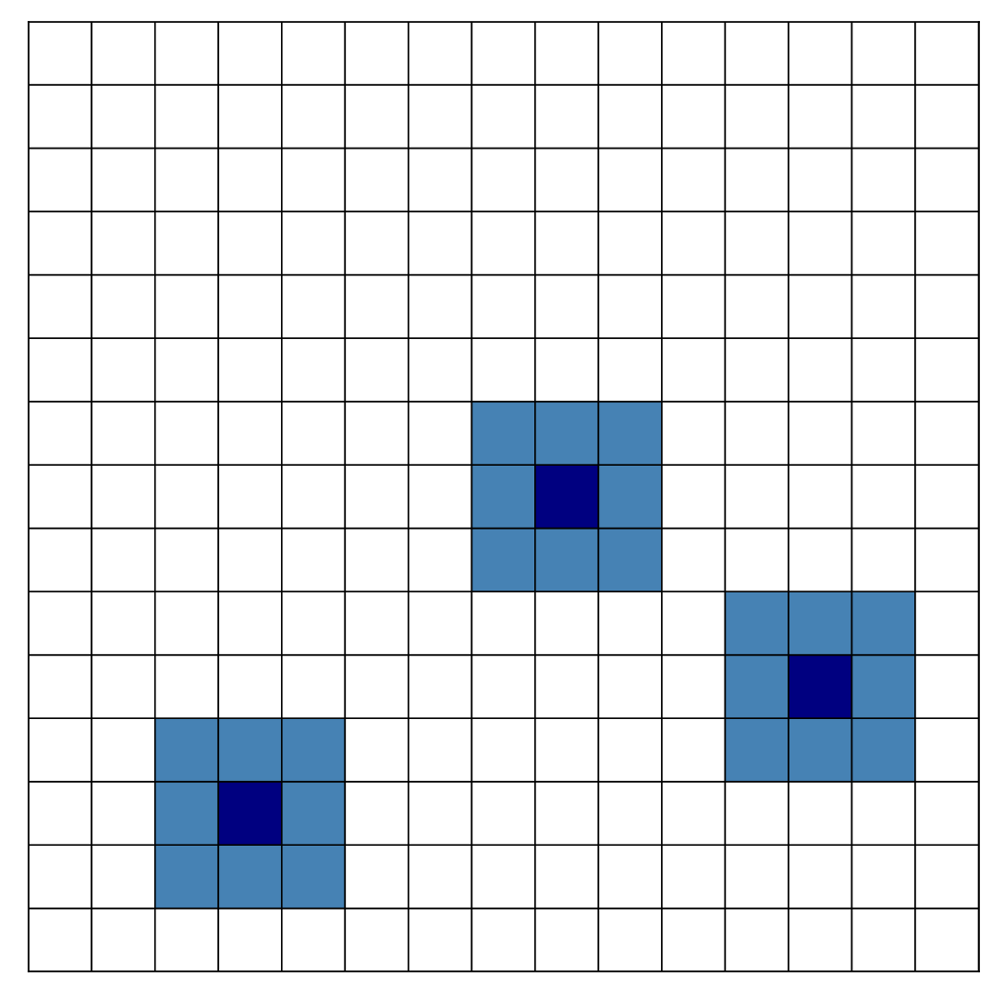

## About
This is prototype version of educational project on C++ for enumeration combinations on square 2d-grid.

Combinations can be restricted by 
- grid size **N** and number of items **M**
- minimum distance between items **r**
- maximum distance to the nearest item (connectivity) **R**
- uniqueness relatively rotations, reflections and shifts
- fixed arbitrary subset of items **template**

Can be used for building custom scenarios in C++ code (check out tests_OEIS() function for working example)

## Requirements
g++, CMake

## Template file
2*n integer numbers for coordinates of fixed items, can be left empty

## Usage
- Build project from code with **CMake** and **make**:
```
cmake -G "Unix Makefiles" .
make
```

- Run:
```sh
 combs_on_grid /path_to_template
```
## Examples
On the project picture you can see **m=3** items on grid 
with size **n=15**, constrained by **r=2** that means that minimal distance objects
can be placed near to each other is equal to r.

That is exactly conditions for kings on chessboard problem (OEIS: A061996).

Code for this problem would look like this:
```
int N=15, M=3, r_param = 2, R_param = 100;
vector <pair <int, int>> fixed_template;    
CombGenerator gen = CombGenerator(N, M, r_param, R_param, fixed_template);

gen.combs_on_grid();
```
  

